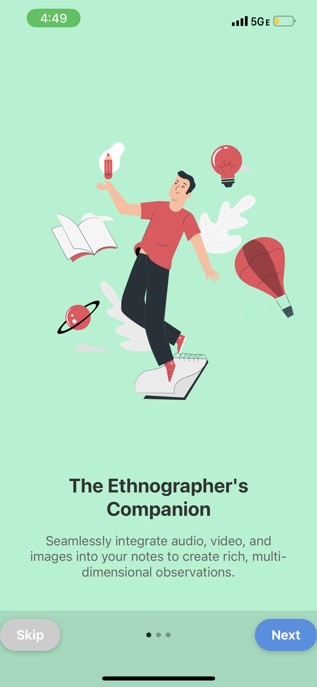
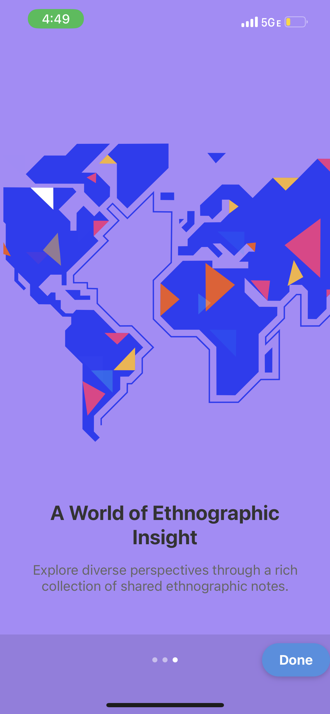
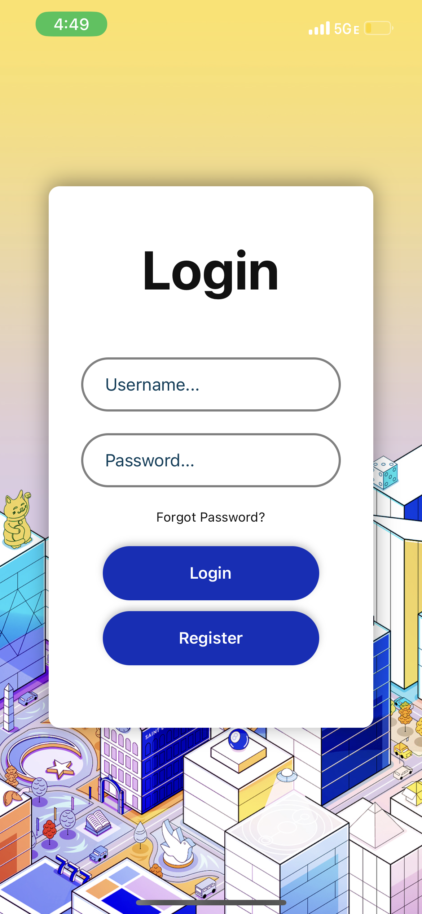
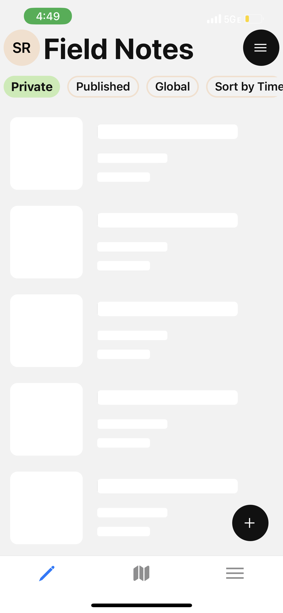
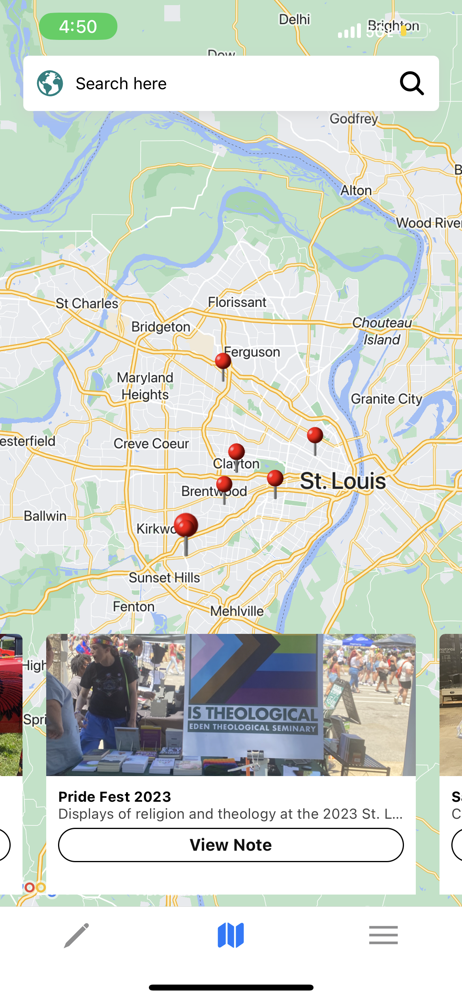
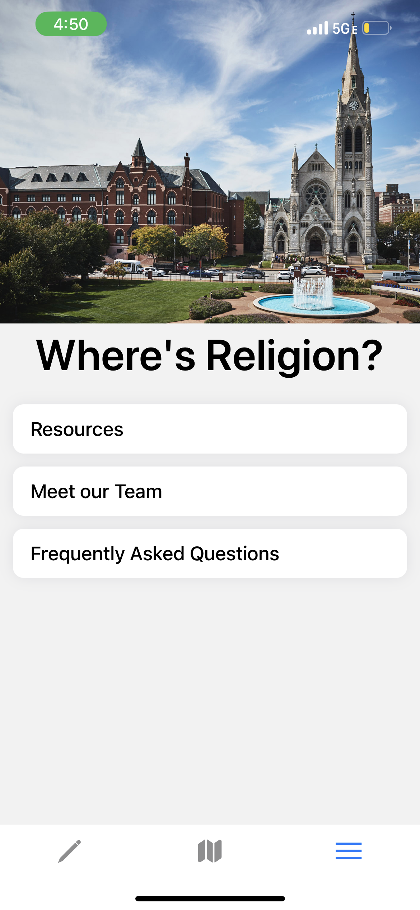
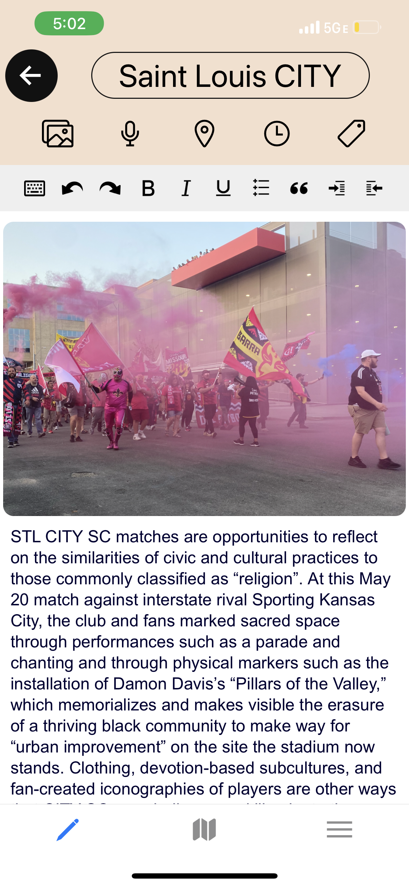
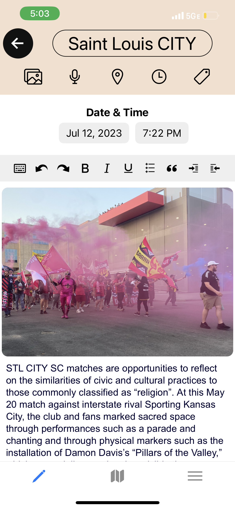

# LRDA Mobile

## Overview
LRDA Mobile is the mobile app for the Lived Religion Application (LRDA), designed to provide ethnographers with an accessible platform to share their data worldwide. Built using React Native and TypeScript, this app connects to the Rerum Website to facilitate seamless data integration.

## Screenshots

### Onboarding
<div style="display: flex; justify-content: space-between;">
  
  
  
</div>


### Login Page
<div style="display: flex; justify-content: space-between;">
  
  
</div>


### Home Page
<div style="display: flex; justify-content: space-between;">
  
  
</div>


### Map Page
<div style="display: flex; justify-content: space-between;">
  
  
  
</div>

### More Page
<div style="display: flex; justify-content: space-between;">
  
</div>

### Note Page
<div style="display: flex; justify-content: space-between;">
  
  
</div>


## Installation

### Prerequisites
Make sure you have Node.js, React Native, and Expo CLI installed on your machine. If you need guidance, please follow the [React Native Getting Started guide](https://reactnative.dev/docs/getting-started).

### Dependency Installation
Once you have the prerequisites installed, you can install the dependencies for the app by running:

```bash
yarn install
```

### Starting the App
To start the app, run:

```bash
expo start -c
```

This command will start the Expo server, compiling the JavaScript code for the app, which you can run either on a simulator or your mobile device.

## Running via Simulator
Depending on whether you have an Android or an iOS device, when you run `expo start -c`, it will provide a QR code along with options `a` for running on an Android simulator or `i` for running the application on an iOS simulator.

## Running via Phone
To run the application on your phone, you need to download the **EXPO** application, available on both the Android Play Store and iOS App Store.

## Usage
Launch the app on your device or emulator using the `expo start -c` command. This will open the Expo DevTools in your browser, where you can select the device or emulator to run the app.

## Known Bugs
- The app does not compile to the web due to a dependency on react-native-maps.
- In the location data section of a note, an error displaying "NaN" may appear.
- Audio recording and playback inside of a note does not work on Android Devices

## License
LRDA Mobile is released under the MIT License.
