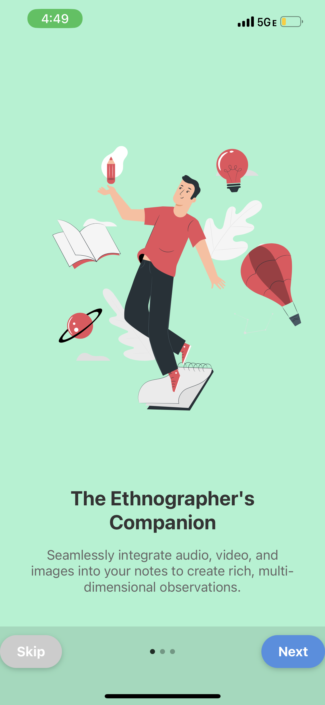
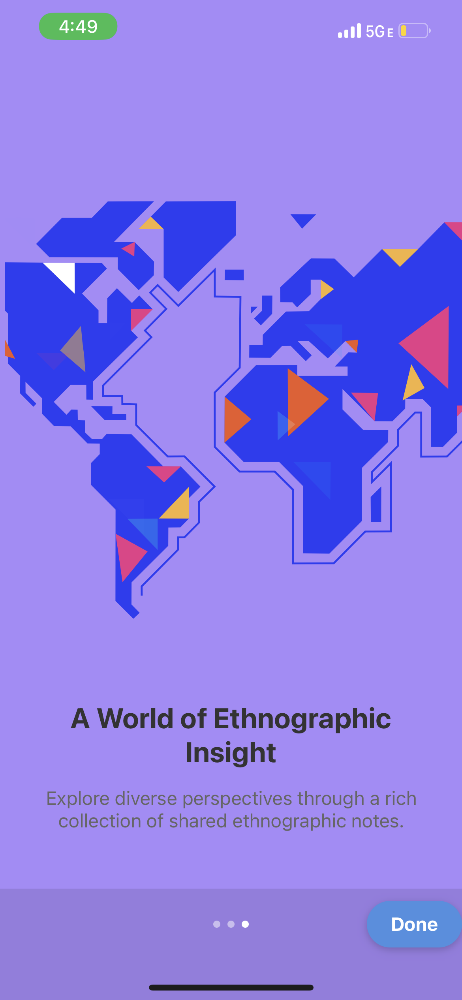
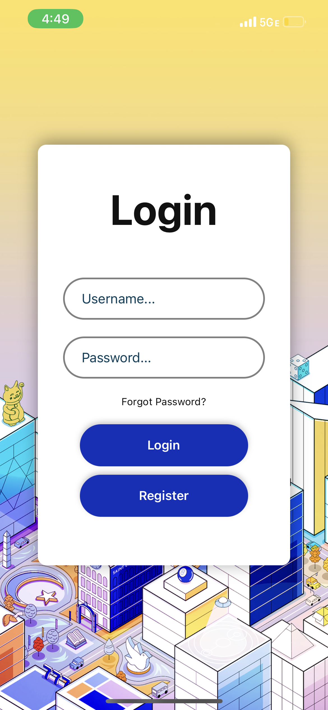
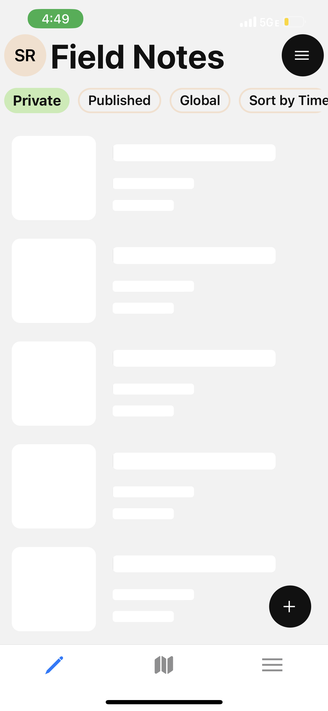
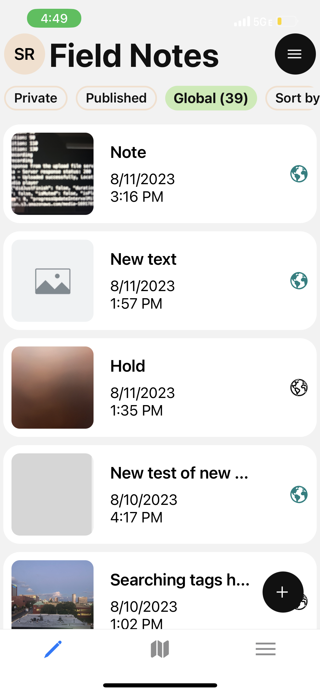
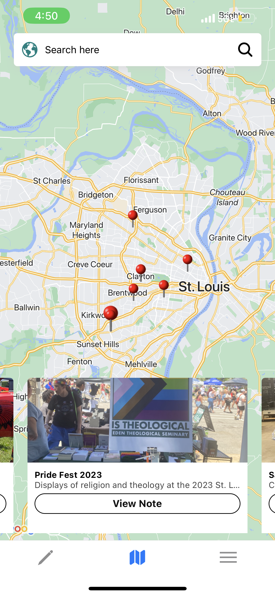
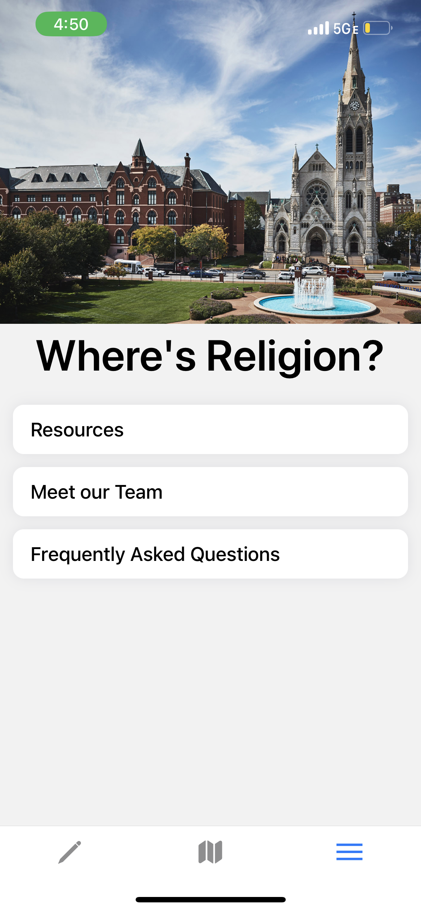
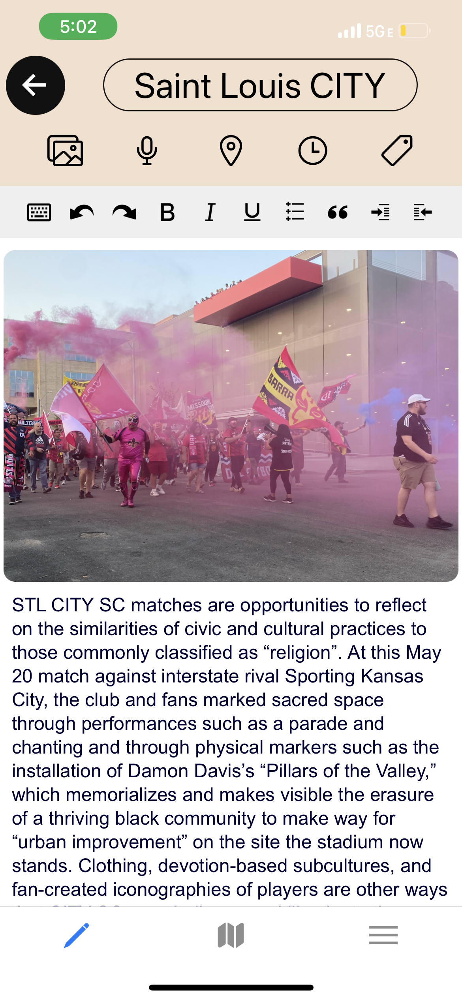
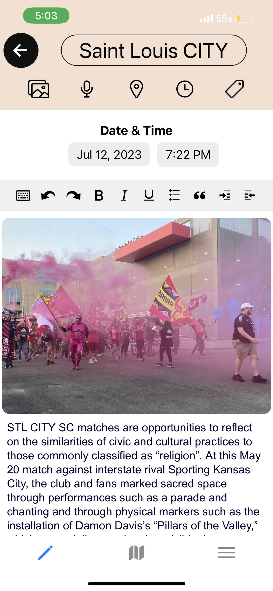

# LRDA Mobile

**Product Owner:** [Adam Park](https://github.com/park353) | Part of the [Where's Religion](https://wheresreligion.org) project, funded by the Henry Luce Foundation and developed through [Open Source with SLU](https://github.com/oss-slu).

## Overview

LRDA Mobile is the mobile app for the Lived Religion Application (LRDA), designed to provide ethnographers with an accessible platform to share their data worldwide. Built using React Native and TypeScript, this app connects to the Rerum Website to facilitate seamless data integration.

## Screenshots

### Onboarding

<div style="display: flex; justify-content: space-between;">
  
  
  
</div>

### Login Page

<div style="display: flex; justify-content: space-between;">
  
  
</div>

### Home Page

<div style="display: flex; justify-content: space-between;">
  
  
</div>

### Map Page

<div style="display: flex; justify-content: space-between;">
  
  
  

</div>

### More Page

<div style="display: flex; justify-content: space-between;">
  
</div>

### Note Page

<div style="display: flex; justify-content: space-between;">
  
  
</div>

## Installation

### Prerequisites

Make sure you have Node.js, React Native, and Expo CLI installed on your machine. If you need guidance, please follow the [React Native Getting Started guide](https://reactnative.dev/docs/getting-started).

### Dependency Installation

Once you have the prerequisites installed, you can install the dependencies for the app by running:

```bash
pnpm install
```

### Starting the App

To build and run the app on a simulator, run:

```bash
pnpm ios       # iOS simulator
pnpm android   # Android emulator
```

These commands build the native app, install it on the simulator, and start the Metro bundler. After the first build you can restart just the bundler with `pnpm start`.

## Running via Phone

The app uses native modules (such as react-native-maps) that are not included in the Expo Go app, so it requires a development build. Connect a device and run `pnpm ios --device` / `pnpm android --device`, or install a build produced by EAS (`pnpm build:ios` / `pnpm build:android`).

## Known Bugs

- The app does not compile to the web due to a dependency on react-native-maps.
- Scroller on add note and edit note sometimes do not work on IOS
- The notes orientation on map page for android is off centered.

## License

LRDA Mobile is released under the MIT License.
